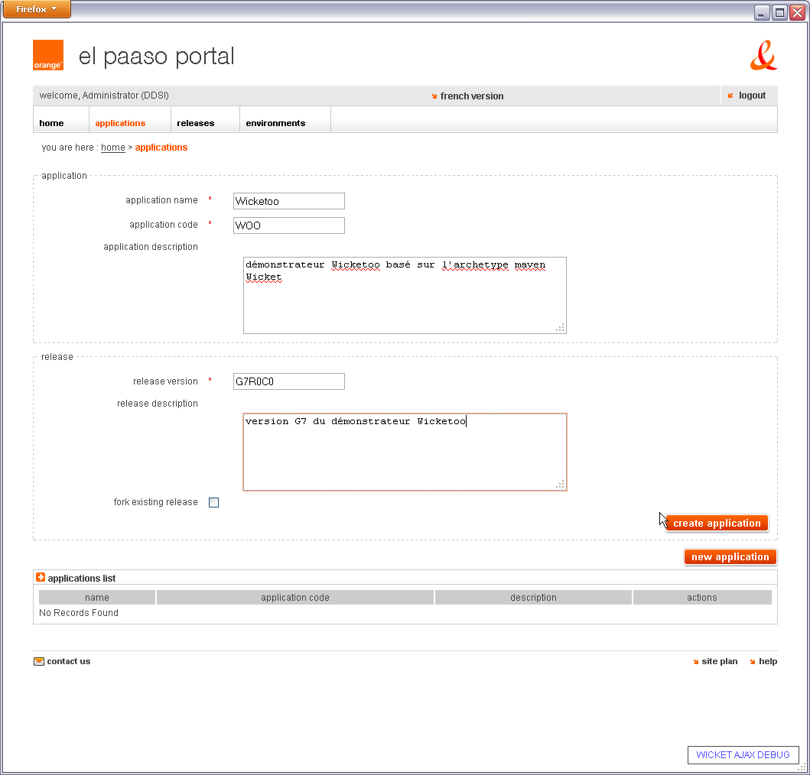
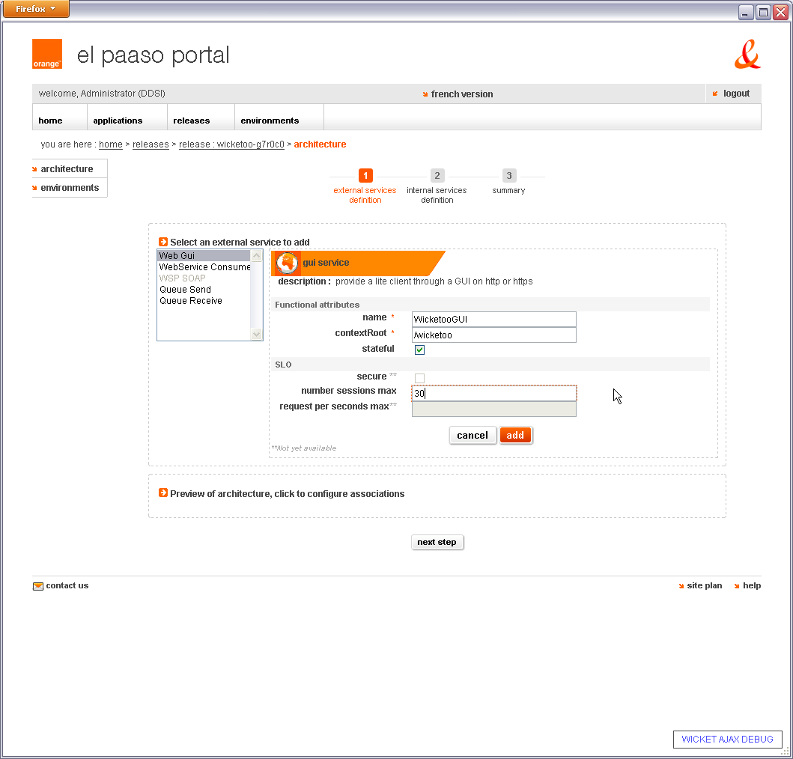
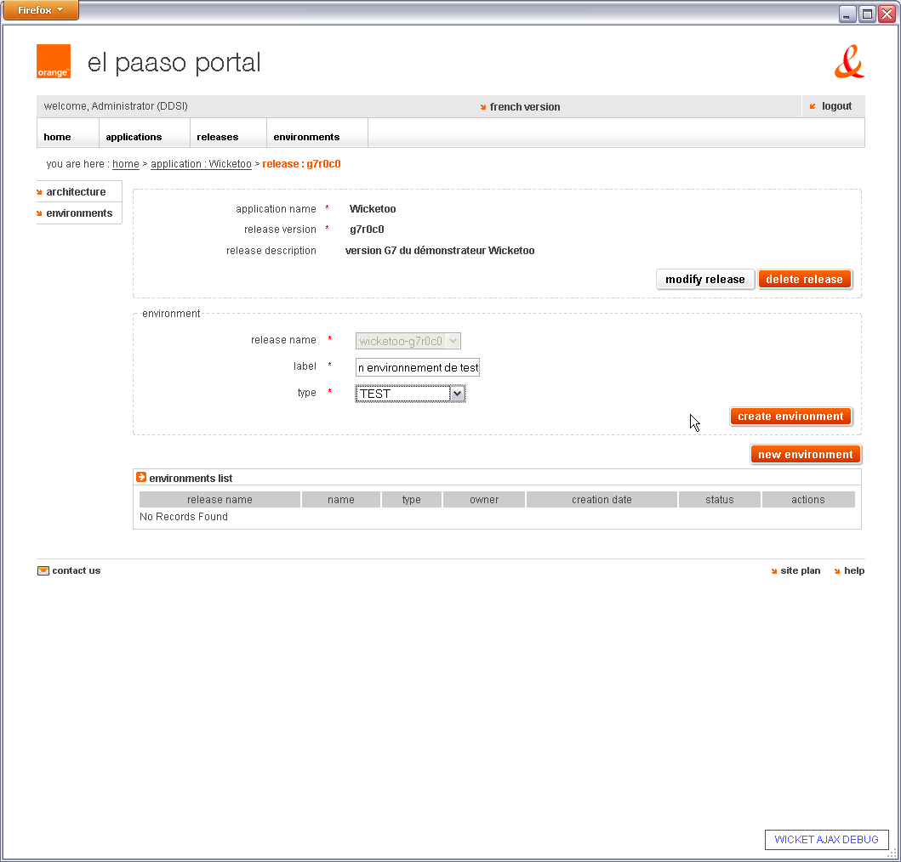

# web UI overview

The web UI is the main way to interact with El PaaSo. It currently includes the following modules:

* the administration UI itself,
* the consolidated logs tool,

After authentication, the UI offers to:

* self-service application management:
    * [declaring applications and creating application releases](#declaring_applications_and_creating_application_releases)
    * defining the logical architecture,
        * [creating logical services](#creating_logical_services),
        * [creating execution nodes](#creating_execution_nodes),
        * [setting associations between execution nodes and logical services](#setting_associations_between_execution_nodes_and_logical_services),
    * starting a projection from the logical architecture to a technical architecture templates
    * [instanciating and managing environments](#instanciating_and_managing_environments) for development, testing, pre-production or production
* accelerate deployments and improve their reliability,
* get exactly the same architecture from one environment to another (reproducible environments),

Defining a logical architecture consists in determining the number of execution nodes, to associate them logical services specifying with additional functional or technical parameters.

## screenshots

Screenshots give a better idea of how to use El PaaSo and its web UI.

### declaring applications and creating application releases

### creating logical services

### creating execution nodes

### setting associations between execution nodes and logical services

### instanciating and managing environments

