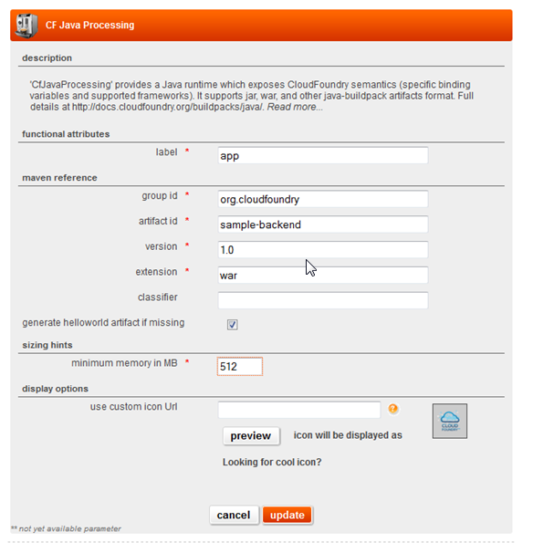

## overview

The cf-java-processing service is an internal service that provides the ability to run java component inside an application server container.

It supports the semantics of the [CloudFoundry java-buildpack](https://github.com/cloudfoundry/java-buildpack/)

## usage

Using a cf-java-processing service is mandatory if your application has been coded using the java language.

### integration with other services

The subscribed internal services (e.g. RDB, Online storage) are attached to the JEE processing service
and made available to the application through the standard CloudFoundry environment variables, see https://docs.cloudfoundry.org/devguide/deploy-apps/environment-variable.html

## detailed specifications

### user interface attributes

Functional attributes:

* **label**: A label to identify the service.

Maven reference:

The maven reference identifies your artefact in the corporate maven repository. 

* **group id**: Indicate the group id of the maven artifact of the ear to deploy.
* **artifact id**: Indicate the artifact id of the maven artifact of the ear to deploy.
* **version**: Indicate the version of the maven artifact of the ear to deploy.
* **classifier**: Indicate the (optionnal) classifier of the maven artifact of the ear to deploy.

Sizing hints:

* **minimum memory in MB**: Indicate the minimum memory needed by your ear to avoid *out of memory error*. For development environments, this parameter is currently assigned to application server's JVM max memory.

Display options:

* **use custom icon Url**: Indicate the url of a custom icon that you want to use to represent this service in the matrix. The url must be an http url and must be reachable by El PaaSo and by workstations that will consult the matrix.

### sizing

The sizing of your processing service is managed by El PaaSo but the minimum memory parameter gives an important hint to El PaaSo in order to allocate the necessary memory to your app.

The sizing also depends on your environment type : a developement environment will not have the same sizing as a production or a pre-production environment.

### logs

Application write their logs to STDOUT or STDOUT which then get streams to the log aggregation tool.

Logs can be accessed on the *processing service logs* link next to the processing service on the environment page.

## programming model

1. Your application has to be coded in java, using Java 1.8 
2. Your application ear must be published and available on the group maven repository.

The application should comply with a moderately constrained programming model similar to JavaEE
model, see http://12factor.net/, in particular

* The file system is ephemeral and should not be relied upon for persistent data. The application should use the data related services instead (see [relational database service](relational_database_service.html) or [using the blob store service](blob_store_service.html)).
* Prefer stateless processing: the underlying OS container may not provide high availability (HA) and uptime guarantees, the application should favour storing state on data related services than relying on in memory caches/stores.
* No direct network access: the application instead should use communication services to communicate with other processing services within the application (see [internal MOM service](internal_mom_service.html)) or with other applications (see Web Service and Point-to-point messaging)

### stateless processing nodes

The principle of stateless processing nodes relies in the fact that the sustainability of container running Java processing service can't be guaranteed by the PaaS. 

A specific application instance can be restarted, or migrated automatically at any time. Any stored in RAM or on the ephemeral file system would be lost upon restarting. It is therefore recommended to use services offered by the PaaS to store these data (database as a service, file storage as a service, online storage as a service) than relying on in memory caches/stores.

If you need to store temporary data, El PaaSo recommend the following APIs:

* [File.createTmpFile()](http://docs.oracle.com/javase/6/docs/api/java/io/File.html#createTempFile%28java.lang.String,%20java.lang.String%29)
* [ServletContext.TEMPDIR](http://docs.oracle.com/javaee/6/api/javax/servlet/ServletContext.html#TEMPDIR)

This temporary space is dedicated to storing temporary data and therefore subject to the following restrictions:

* restriction in terms of max MB on disk (100 MB)
* temporary data may be lost
* temporary data are not shared among VMs

