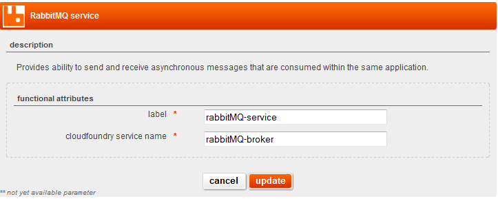

## overview

The Internal RabbitMQ Service provides the ability to send and receive asynchronous messages that are consumed within the same application using [RabbitMQ message broker](http://www.rabbitmq.com/).

## usage

The Internal RabbitMQ service is used as a mechanism to allow asynchronous request processing. You may wish to do this because the request take a long time to complete or because several parties may be interested in the actual request.

## detailed specifications

### user interface attributes

#### main destination attributes

Functional attributes:

* **label**: A label to identify the service within the logical architecture.
* **cloudfoundry service name **: Name of cloud foundry service instance. Must be unique within all Internal RabbitMQ services declared in the architecture.

## application examples

### sending a message

A very basic class used to send a message:

    import org.springframework.amqp.core.AmqpTemplate;

    public class MySender {

        private AmqpTemplate rabbitTemplate;

        public void sendMessage(String message) {
            rabbitTemplate.convertAndSend("foo");
        }
    }

And the associated Spring configuration:

    <beans xmlns="http://www.springframework.org/schema/beans"
           xmlns:xsi="http://www.w3.org/2001/XMLSchema-instance"
           xmlns:rabbit="http://www.springframework.org/schema/rabbit"
           xsi:schemaLocation="http://www.springframework.org/schema/rabbit
               http://www.springframework.org/schema/rabbit/spring-rabbit.xsd
               http://www.springframework.org/schema/beans
               http://www.springframework.org/schema/beans/spring-beans.xsd">

        <rabbit:connection-factory id="connectionFactory"/>

        <rabbit:template id="rabbitTemplate" exchange="my.exchange"
        					routing-key="request.queue" connection-factory="connectionFactory"/>

        <rabbit:queue name="request.queue"/>

        <rabbit:direct-exchange name="my.exchange">
			<rabbit:bindings>
				<rabbit:binding queue="request.queue" key="request.queue" />
			</rabbit:bindings>
		</rabbit:direct-exchange>

    </beans>

### asynchronously receiving a message

A very basic class used to receive a message asynchronously:

    import org.springframework.amqp.core.MessageListener;
    import org.springframework.amqp.core.Message;

    public class MyListener implements MessageListener {

        public void onMessage(Message message) {
            // Do your stuff here
        }

    }

And the associated Spring configuration:

    <beans xmlns="http://www.springframework.org/schema/beans"
               xmlns:xsi="http://www.w3.org/2001/XMLSchema-instance"
               xmlns:rabbit="http://www.springframework.org/schema/rabbit"
               xsi:schemaLocation="http://www.springframework.org/schema/rabbit
                   http://www.springframework.org/schema/rabbit/spring-rabbit.xsd
                   http://www.springframework.org/schema/beans
                   http://www.springframework.org/schema/beans/spring-beans.xsd">

     <rabbit:connection-factory id="connectionFactory"/>

     <rabbit:queue name="request.queue"/>
      
      <!-- This is the Message Driven POJO (MDP) -->
      <bean id="myListener" class="com.francetelecom.package.MyListener" />

      <!-- and this is the message listener container -->
      <rabbit:listener-container
      			connection-factory="connectionFactory" acknowledge="auto"
      			concurrency="1" channel-transacted="true">
      			<rabbit:listener queues="request.queue"
      				ref="myListener" />
      </rabbit:listener-container>

    </beans>

