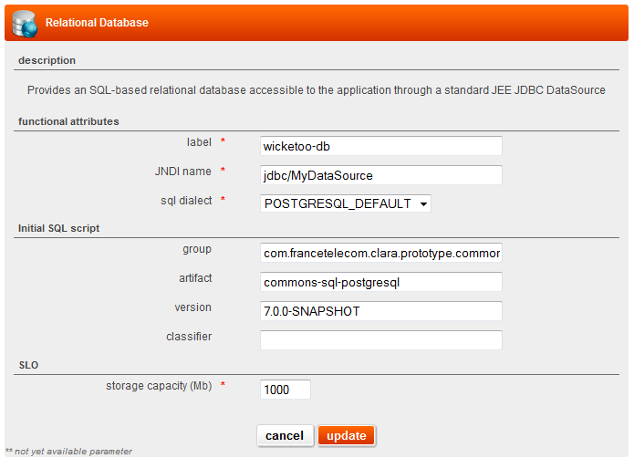

## overview

El PaaSo relational database service (RDS) provides relational databases including MySQL and PostgreSQL.

## usage

El PaaSo RDS allows you to request a database providing its SQL dialect (MySQL or PostgreSQL) and its storage size. The created database is made available through cloudfoundry VCAP_SERVICES environment variable, under the specified service instance name.

There are other ways to store data, such as [blob store service](blob_store_service.md) for flat files and binary files.

NoSQL might be another good alternative to relational database in a near future.

## detailed specifications

### user interface attributes

Functional attributes:

* **label**: A label to identify the service.
* **cloud foundry service name**: name of the CF service that will be bound to the processing. Will be used by the code.
* **sql dialect**: The dialect that you will use will decide which database engin will manage your data:
    * POSTGRESQL_DEFAULT will enable a PostgreSQL database engine,
    * MYSQL_DEFAULT will enable a MySQL database engine,
    * DEFAULT will enable a relational database engine (use it if your have no particuliar requirements).

SLO:

* **storage capacity (Mb)**: Indicate the size of your database.

### sizing

The storage capacity parameter includes all data, indexes and additional disk space such as redo logs to run the database instance.

Please, be aware that you should set this capacity regarding the environment type (smaller for development and bigger for production).

### logs

No specific logs are available except those you are implementing in your execution nodes.

## programming model

Mysql version is 5.5. InnoDB is systematically enabled by El PaaSo RDB Service (so a hibernate project should use org.hibernate.dialect.MySQLInnoDBDialect). Depending on which dialect you choosed for your relational database service, the mandatory rar module is provided by El PaaSo.

The database credentials are injected as CloudFoundry-formatted environment variables, see https://docs.cloudfoundry.org/devguide/deploy-apps/environment-variable.html
 
The java buildpack may provide facilities such as mysql driver download and [spring support](http://docs.cloudfoundry.org/buildpacks/java/spring-service-bindings.html)

The *storage capacity* parameter includes all data, and any indexes required additional disk space (such as redo logs) to run the database instance.

### liquibase to manage database schema

The app should automatically manage its database schema using tools such as [liquibase](http://www.liquibase.org/) (in both creation and modification changesets).

### upcoming features

Following features are planned and will be available in a future version:

* pgadmin and phpmyadmin in order to manage your database content
* backup/restore
* snapshot/restore
* automatic database content import on new environment creation

