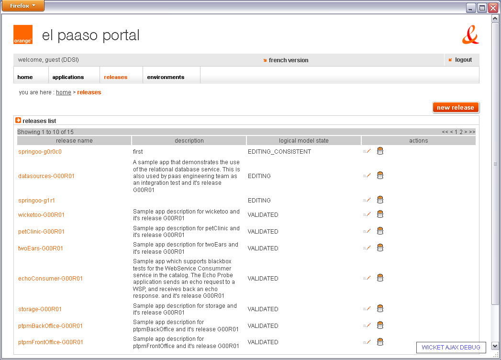
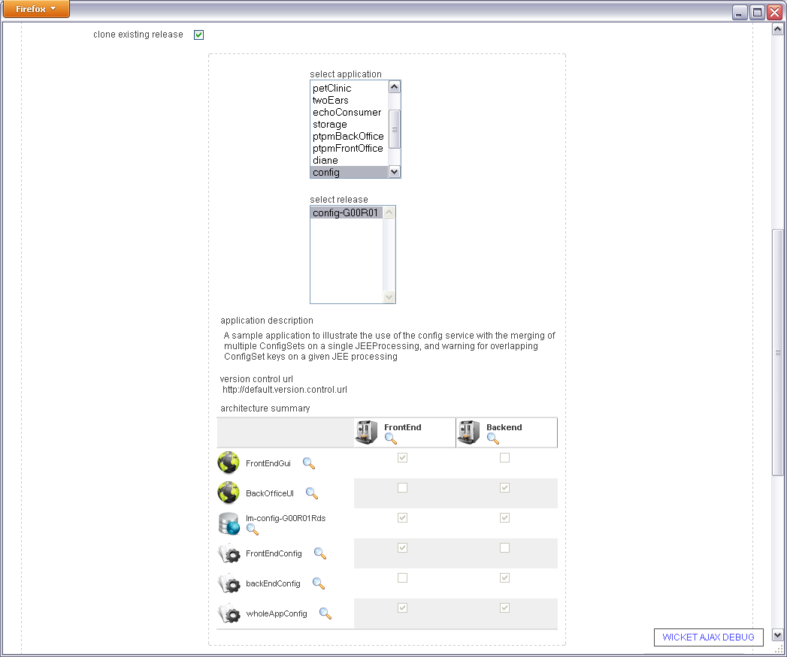
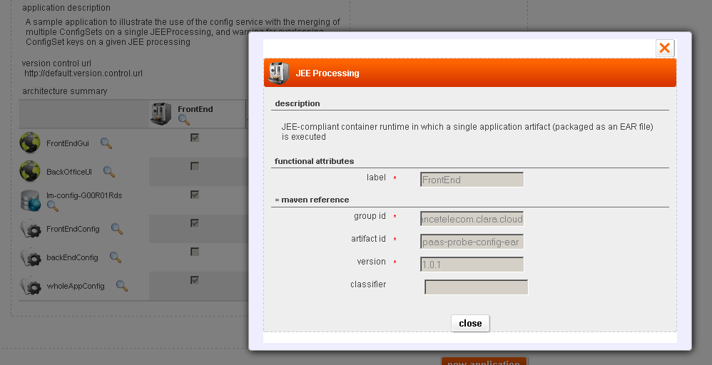

A set of sample public applications is available within the paas ui as illustrated in following screenshot:

These applications may be useful for developers as example of how to leverage JEE integration points into the PaaS. They may be cloned and modified within the web portal as illustrated in following screenshot.

Sample applications maven artifacts can be fetched from maven references of the JEE processing service.

Samples source code is available on [elpaaso-system-test-apps](https://github.com/Orange-OpenSource/elpaaso-system-test-apps) and [elpaaso-samples](https://github.com/Orange-OpenSource/elpaaso-samples) repos 

Here is an overview of some of the sample apps:

* echo-parent: illustrates how to use the
    * external service "Web Service Consumer",
    * Relational DB (DataSourceImpl)
    * Logging (LogProbeImpl)
    * Online storage (StorageProbeImpl)
* paas-probe-config: illustrates how to use the internal service "Config",
* petclinic-parent: Spring sample modified to use El PaaSo and blob store service (details about petclinic are available on [SpringSource website](http://static.springsource.org/docs/petclinic.html).