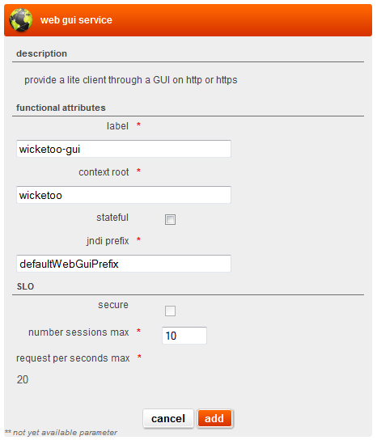

## overview

The web graphical user interface service (web GUI) is an external service that provides the ability to publish a graphical user interface on http or https protocol.

## detailed specifications

### user interface attributes



Functional attributes:

* **label**: A label to identify the service.
* **context root**: (Non-Jee applications may ignore this field and leave the default "/" value). <br /> 
Java applications using the JeeProcessing can embed multiple web applications in a single EAR artefact. The context-root field identifies the Java Web module to which this WebGui service will route traffic to. (eg http://&lt;host&gt;:&lt;port&gt;/&lt;context-root&gt;/...).
<br />
Context-root field is mandatory. At minimal it should be the root path i.e. "/". (context-root should always start with a forward slash "/") <br/>
The Web module context-root field is declared into the META-INF/application.xml descriptor. For maven-built apps, this is typically configured in the maven packaging of the application using the maven-ear-plugin. See http://maven.apache.org/plugins/maven-ear-plugin/examples/customizing-context-root.html.
* **stateful**: This checkbox indicate whether your application is statefull or not. This will give hints to El PaaSo on how to scale your application.
* **JNDI prefix**: JNDI prefix will help El PaaSo to make each JNDI name unique even if multiple ear are using the same JNDI name. The ```{jndiPrefix}.url``` key will be injected with a value containing the URL at which this service will be available. This is useful for some applications that need to share their exposition URL with their users (e.g. an email that points to the application) or with other applications (e.g. to receive callbacks)

SLO attributes:

* **secure**: Indicate if your application need to be made availabe on http or on https.
    * *This option has no effect as https is not yet supported by El PaaSo.*
* **number session max**: Maximum number of simultaneous session on the web server. This will give hints to El PaaSo for the sizing of your application infrastructure.
* **request per second max**: Maximum request per second on the web server. This will give hints to El PaaSo for the sizing of your application infrastructure.

### sizing

The sizing of your application is automatically handled by El PaaSo using its own internal expert rules and the SLO parameters set on the web gui service (*number session max* and *request per second max* parameters).

The sizing also depends on your environment type : a developement environment will not have the same sizing as a production or a pre-production environment.

### security

The application is in charge of its own security feature such as user authentication, XSS and CRSF vulnerabilities, SQL injection...

### logs

WebGui HTTP traffic access log are available using the embedded log aggregation tool. It is accessible using the *gui service logs* link next to the gui service on the environment page.

### monitoring

Not yet available.

## application examples

### full application example

Some application examples are available on the elpaaso-sample or [elpaaso-system-test-apps](https://github.com/Orange-OpenSource/elpaaso-system-test-apps) repos

